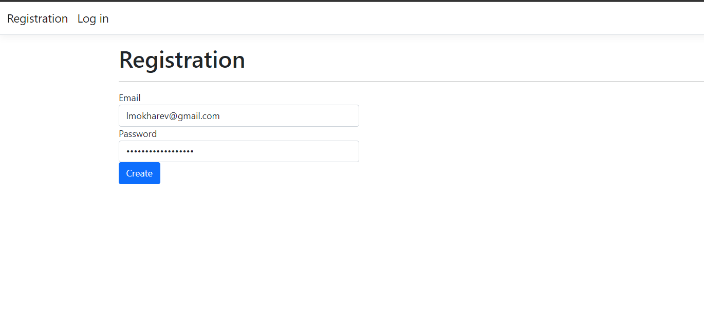
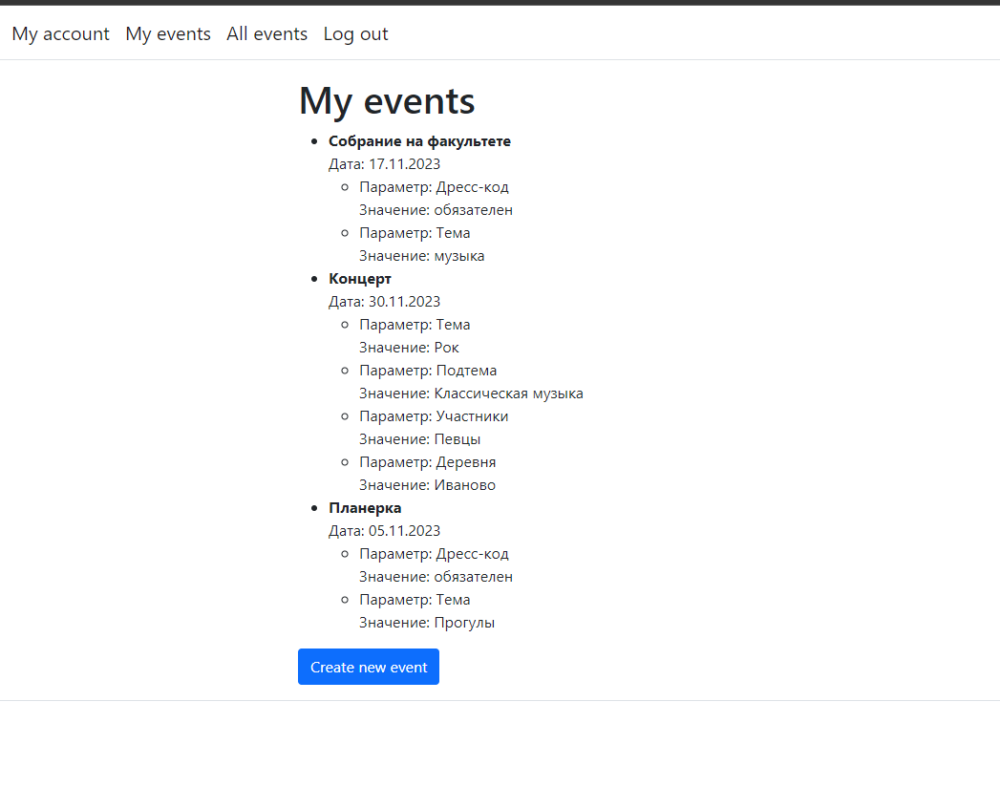

# Тестовое задание
## Здесь я дам несколько пояснений к тестовому заданию.

### Итак, это клиенская часть приложения, в котом можно регистрироваться посредством подтверждения email и создавать.регистрироваться на мерояприятие.

### Создадим пользователя. Введем email и придумаем пароль:

### Далее нажмем на кнопку "Create" и нас автоматически перенесет на страницу авторизации:

### Попробуем зайти без подтверждения email:

### Получим ошибку, что email не подтверждем. Далее зайдем в почту и подтвердим почту: 

### Нажмем на кнопку "Verify email" и подтвердим свой адрес. Далее мы сможем авторизоваться:  

### Как видно, у пользователя нет данных о имени и фамилии. Исправим это! Нажмем на кнопку "Edit profile" и перейдем на страницу для изменения профиля: 

### Нажмем на кропку "Update" и изменим данные пользователя: 

### Кроме того, можно изменить существующий пароль: 

### Далее зайдем во вкладку "My events" и создадим несколько событий. Первое событие будет содержать 2 параметра:

### И второе событие будет содержать 4 параметра: 

### После создания событий вкладка "My events" будет выглядеть так: 

### Далее зарегистрируемся на какое нибудь мероприятие. Откроем вкладку "All events": 

### Как можно заметить, здесь есть два мерояприятия, новых для нас. Давайте зарегистрируемся на "Планерка". Для этого нажмем на кропку "Registrate" рядом с названием названия события. После этого, вкладка "My events" будет выглядить так: 

### Как видно, событие "Планерка" добавилось в наши события. Мы успешно зарегистрированы.